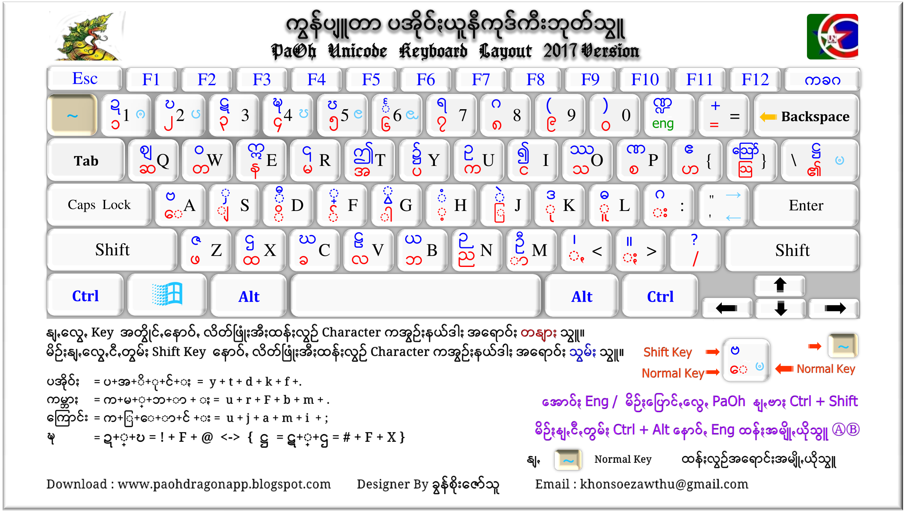

**Windows** ကွန်ပျူတာတွေမှာပအိုဝ်းစာရေးနိုင်မယ့် ကီးဘုတ်ဖြစ်ပါတယ်။
[Khon Soe Zaw Thu](https://www.facebook.com/mrkhun.today) က ဖန်တီးပေးထားတာပါ။

## ထည့်သွင်းနည်း
- ဒီ **Repository** ကို **Download** လုပ်လိုက်ပါ။
- [ဒီလင့်](https://github.com/KhunHtetzNaing/macOS-PaOh-Keyboard/archive/main.zip) ကိုနှိပ်ပြီးတော့လည်းဒေါင်းနိုင်ပါတယ်။
- ဒေါင်းလို့ရလာတဲ့ **main.zip** ကိုဖွင့်ပြီး **Keyboard** folder ထဲက **setup.exe** ကို **Double click** နဲ့ **Run** လိုက်ပါ။
- ပြီးရင်ကွန်ပျူတာကို **Restart** ချလိုက်ပါ။
- ကွန်ပျူတာပြန်တက်လာရင် ပအိုဝ်းစာရိုက်လို့ရပါပြီ။
- **Ctrl+Shift** ဒါမှမဟုတ် **Ctrl+Space** ကိုနှိပ်ပြီးတော့ ပအိုဝ်ႏ+အင်္ဂလိပ်အပြန်အလှန်ပြောင်းလို့ရပါတယ်။

# စာရိုက်နည်း
ယူနီကုဒ်စာရိုက်နည်းအတိုင်း သဝေထိုး ကိုနောက်မှရိုက်ရပါတယ်။

> ဥပမာ -

-   ကျောင်း = က + ျ + ေ + ာ + င + ်​ + း
-   ကမ္ဘာ = က + မ + ္ + ဘ + ာ
ကျန်တာကတော့ သင်ဘုန်းကြီးစာရေးနည်းအတိုင်းရေးရပါတယ်။
သဝေထိုးကိုလည်း သင်ဘုန်းကြီးစနစ်အတိုင်းရိုက်ချင်ရင်တော့  [Keymagic](https://keymagic.net/)  ကိုသုံးနိုင်ပါတယ်။

# အခြား OS အတွက်ပအိုဝ်းကီးဘုတ်များ

 - [Ubuntu](https://github.com/KhunHtetzNaing/Ubuntu-PaOh-Keyboard)
 - [macOS](https://github.com/KhunHtetzNaing/macOS-PaOh-Keyboard)