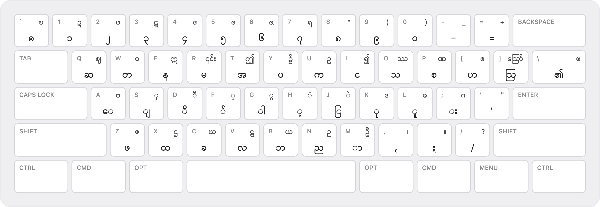

# Windows Pa'O Keyboard ⌨️

Windows စနစ်သုံးကွန်ပျူတာများအတွက် ပအိုဝ်ႏကီးဘုတ်ဖြစ်ပါသည်။
ပြည်ထောင်စုလက်ကွက်ပေါ်မှာအခြေခံထားတဲ့အတွက် ပအိုဝ်း + မြန်မာ (၂) ဘာသာရေးသားနိုင်ပါသည်။

## ထည့်သွင်းနည်း 🛠️

- Keyboard Installer ကို [Download](https://github.com/KhunHtetzNaing/Windows-PaOh-Keyboard/releases) ပြုလုပ်ပြီးဖွင့်ပါ။
- setup.exe ကိုနှိပ်ပြီး Install ပြုလုပ်ပါ။
> Windows protected your PC လို့ပေါ်လာရင် More Info ကိုနှိပ်ပြီး Run anyway ကိုနှိပ်ပေးပါ။

Win + Space ပြိုင်တူနှိပ်ပြီး လက်ကွက်အပြန်အလှန်ပြောင်းနိုင်ပါသည်။

## စာရိုက်နည်း 👨‍💻

ယူနီကုဒ်စာရိုက်နည်းအတိုင်း သဝေထိုး ကိုနောက်မှရိုက်ရပါမယ်။
> သင်ဘုန်းကြီးစနစ်အတိုင်းရိုက်ချင်ရင် [Keymagic](https://keymagic.net/) သုံးနိုင်ပါတယ်။

ကျန်တာအားလုံး သင်ဘုန်းကြီးစာရေးနည်းအတိုင်းရေးရပါတယ် -

- နီခွိုꩻပအိုဝ်ႏ = န + ီ + ခ + ွ + ိ + ု + ꩻ + ပ + အ + ိ + ု + ဝ + ် + ႏ
- ညွှန်ကြားရေးမှူး = ည + ွ + ှ + န + ် + က + ြ + ာ + း + ရ + ေ + း + မ + ှ + ူ + း
- အကြောင်းပြချက် = အ + က + ြ + ေ + ာ + င + ် + း + ပ + ြ + ခ + ျ + က + ်
- မြန်မာ = မ + ြ + န + ် + မ + ာ

### ပါဠ်ဆင့်ရိုက်နည်း

- သင်္ကြန် = သ + င + ် + ္ + က + ြ + န + ်
- ကမ္ဘာ = က + မ + ္ + ဘ + ာ
- အာယုဝဍ္ဎန = အာ + ယ + ု + ဝ + ဍ + ္ + ဎ + န
- ခြင်္သေ့ = ခ + ြ + င + ် + ္ + သ + ေ + ့
- သူဋ္ဌေး = သူ + ဋ + ္ + ဌ + ေ + း
- မဏ္ဍပ် = မ + ဏ + ္ + ဍ + ပ်

## အခြား OS အတွက်ပအိုဝ်းကီးဘုတ်များ 🖥️

- [Ubuntu](https://github.com/KhunHtetzNaing/Ubuntu-PaOh-Keyboard)
- [macOS](https://github.com/KhunHtetzNaing/macOS-PaOh-Keyboard)

## Credits & Thanks 🙏
- [Khon Soe Zaw Thu](https://www.facebook.com/mrkhun.today)
- [KeyMagic](https://github.com/thantthet/keymagic-3)